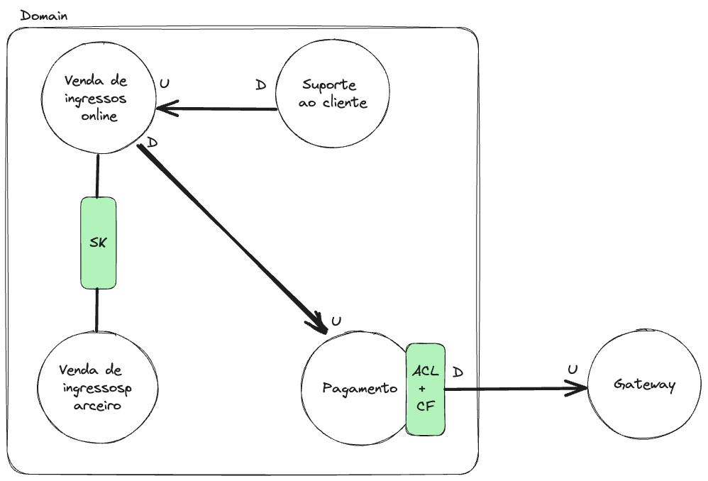

# DDD - Domain Driven Design

> **[Certificado de conclusão do curso](./assets/certification.pdf)**

## 1 Visão Geral

O DDD é uma forma para desenvolver software com o foco de analisar o negócio de uma empresa e identificar qual o coração do negócio (domínio), quais as partes que auxiliam o negócio (subdomínios) e quais as regras e processos que entrelaçam e compõe estes domínios e subdomínios. Tal metodologia tem como propósito separar o que é complexidade de negócio e o que é complexidade técnica, por isso esta abordagem normalmente é recomendada para software de negócios complexos, com muitos setores com perspectivas diferentes e também regras de negócio diversificadas.

Grande parte da complexidade do software está no entendimento do negócio, e como o DDD tenta dividir a complexidade do negócio em domínios e subdomínios é necessário algumas técnicas sociais para conseguir realizar esta segmentação. Para isso, uma das formas de identificar a fronteira entre domínios e/ou subdomínios é por meio da linguagem, ao qual o DDD denomina de linguagem ubíqua (linguagem universal). Como "regra" pode assumir que a transição da fronteira existe quando a linguagem utilizada pelos stakeholders começa a mudar, por exemplo, para um médico o paciente é o equivalente a um cliente, contudo os médicos não utilizam o termo cliente para se referir a um paciente, já para o setor financeiro (deste mesmo hospital/lugar) utiliza o termo cliente para referir ao paciente, embora estejam falando da mesma pessoa, são contextos diferentes. Logo, podemos concluir que palavras diferentes com mesmo significado é um delimitar de fronteira entre contextos, o mesmo vale para situações em que a mesma palavra com significado diferentes. Estas fronteiras entre contextos é denominado **context bounding** ou contexto delimitador.

## 2 Domínios e Subdomínios

O domínio refere-se ao problema principal da empresa e dentro deste podemos localizar o **core domain** que é o coração da empresa, isto é, o diferencial competitivo da empresa. Contudo, para o **core domain** existir muitas vezes é necessário a ajuda de outros setores ou partes da empresa/sistema para fazer com que o **core** funcione, estas partes são denominadas **support subdomains**, ressaltando que estes **subdomains** ainda assim auxilia no diferencial competitivo. Além disso, também existem os **generic subdomains**, ao qual realizam operações auxiliares, mas que não são diferenciais competitivos.

Fazendo uma analogia para explicar contextualizar melhores a definição de domínios, imagine uma que você esta explorando uma floresta e encontra uma caverna (**domain**) e por curiosidade você entra na caverna e descobre que dentro desta caverna tem uma aglomerado de outras cavernas e explorando elas você encontra diamante em uma delas e nas outras encontra água ou uma saída para uma área externa incrível. Após isto, você reúne uma equipe para explorar a caverna interna que contém diamantes (**core domain**) e percebe que é conveniente que existam cavernas com água, por auxiliar os trabalhadores na exploração do diamante e na hidratação (**support subdomains**). Além disso, ao longo do trabalho os operários sempre vão para as outras cavernas com as paisagens incríveis para aproveitar o almoço e descansarem (**generic subdomains**).

## 3 Espaço do problema e espaço da solução

O espaço do problema é uma visão geral do domínio e suas complexidades, junto as delimitações dos subdomínios. Neste momento são coletadas informações para gerar documentações para elaborar a solução.

O espaço da solução consiste em analisar o(s) domínio(s) e criar uma modelagem ou design tático mapeando os agradados, entidades e objetos de valor da aplicação, bem como os eventos de domínio, além de identificar os subdomínios e encontrar os delimitadores de contextos.

Com isto em mãos é possível distinguir a complexidade técnica com a complexidade de negócio e priorizar com mais precisão as partes da aplicação, já que neste momento o processo estaria mapeado em pequenas partes.

## 4 Context mapping

Uma coisa importante de ressaltar é que durante a modelagem é importante manter os contextos com suas respectivas responsabilidades e valores em entidades, pois caso dois contextos utilizem uma mesma entidade mas com significado de negócio diferentes, normalmente gera uma confusão durante o processo de manutenção.

Para realizar o mapeamento do contexto, algumas estratégias podem ser utilizadas, sendo elas:

- **Partnership:** Contextos que realizam uma parceria, no qual os assuntos são muito similares e normalmente existem partes que são iguais.

- **Shared Kernel:** Espaço no qual é compartilhado os mesmo códigos/recursos entre contextos, normalmente o shared kernel existe entre contextos "parceiros".

- **Customer-Supplier Development:** São contexto que existe uma comunicação entre eles, sendo um deles o que fornece o recurso (upstream - U) e o outro consome os recursos (downstream - D).

- **Conformist:** Consiste em utilizar um recurso da forma como ele de fato foi documentado, pois nestas casos não seria possível modificar o fornecedor de recursos. Este mapeamento normalmente são situações de consumo de api's ou recursos de terceiros.

- **Anti-Corruption Layer:** Camada no qual monta-se uma "contrato" com sua aplicação para traduzir os termos de terceiros para os termos do contexto de acordo com a linguagem ubíqua do contexto. Esta camada é muito utilizada em situações conformistas. 

- **Open Host Service:** Definir que existe algum protocolo de serviço para acesso ou funcionar.

- **Published Language:** Definir se existe uma linguagem que é necessária para consumir um contexto específico.

- **Separate Ways:** Representação de contextos que não podem se comunicar.

- **Big Ball of Mud:** Sistema com tudo misturado "sem" organização.

A imagem abaixo mostra um exemplo de uma modelagem simples utilizando padrões do DDD

Para mais detalhes existe um repositório no github [DDD-Crew](https://github.com/ddd-crew/context-mapping) que demonstra uma padronização de documentação para a modelagem de contexto.

